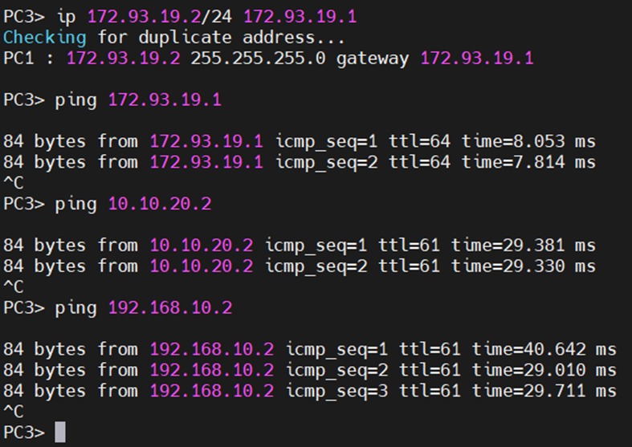

# Настройка OSPF на EcoRouter: Пошаговое руководство

В данном руководстве мы рассмотрим, как настроить протокол OSPF на роутерах ABR, R1, R2 и R3 с использованием EcoRouter. Цель состоит в обеспечении динамической маршрутизации между разными сетями.


## 1. Настройка ABR

### Шаг 1: Изменение имени хоста
```bash
R1(config)#hostname ABR
```

### Шаг 2: Настройка интерфейсов
Интерфейс int1 (подключение к R1)
```bash
ABR(config)#interface int1
ABR(config-if)#ip address 83.53.44.1/30
ABR(config-if)#exit
```
Интерфейс int2 (подключение к R2)
```bash
ABR(config)#interface int2
ABR(config-if)#ip address 64.40.4.1/30
ABR(config-if)#exit
```
Интерфейс int3 (подключение к R3)
```bash
ABR(config)#interface int3
ABR(config-if)#ip address 73.24.93.1/30
ABR(config-if)#exit
```

### Шаг 3: Настройка OSPF
```bash
ABR(config)#router ospf 1
ABR(config-router)#network 83.53.44.0/30 area 0.0.0.0
ABR(config-router)#network 64.40.4.0/30 area 1.1.1.1
ABR(config-router)#network 73.24.93.0/30 area 2.2.2.2
ABR(config-router)#exit
```

### Шаг 4: Настройка сервисных экземпляров для портов
Порт ge0 для int1
```bash
ABR(config)#port ge0
ABR(config-port)#service-instance int1/ge0
ABR(config-service-instance)#encapsulation untagged
ABR(config-service-instance)#connect ip interface int1
ABR(config-service-instance)#exit
ABR(config-port)#exit
```
Порт ge1 для int2
```bash
ABR(config)#port ge1
ABR(config-port)#service-instance int2/ge1
ABR(config-service-instance)#encapsulation untagged
ABR(config-service-instance)#connect ip interface int2
ABR(config-service-instance)#exit
ABR(config-port)#exit
```
Порт ge2 для int3
```bash
ABR(config)#port ge2
ABR(config-port)#service-instance int3/ge2
ABR(config-service-instance)#encapsulation untagged
ABR(config-service-instance)#connect ip interface int3
ABR(config-service-instance)#exit
ABR(config-port)#exit
```

### Шаг 5: Сохранение конфигурации
```bash
ABR#write
```

## 2. Настройка R1

### Шаг 1: Настройка интерфейсов
Интерфейс int1 (подключение к ABR)
```bash
R1(config)#interface int1
R1(config-if)#ip address 83.53.44.2/30
R1(config-if)#exit
```
Интерфейс int2 (локальная сеть)
```bash
R1(config)#interface int2
R1(config-if)#ip address 192.168.10.1/24
R1(config-if)#exit
```

### Шаг 2: Настройка OSPF
```bash
R1(config)#router ospf 1
R1(config-router)#network 83.53.44.0/30 area 0.0.0.0
R1(config-router)#network 192.168.10.0/24 area 0.0.0.0
R1(config-router)#exit
```
R1 находится в области 0.0.0.0 и обменивается маршрутами с ABR.

### Шаг 3: Настройка сервисных экземпляров для портов
Порт ge0 для int1
```bash
R1(config)#port ge0
R1(config-port)#service-instance int1/ge0
R1(config-service-instance)#encapsulation untagged
R1(config-service-instance)#connect ip interface int1
R1(config-service-instance)#exit
R1(config-port)#exit
```
Порт ge1 для int2
```bash
R1(config)#port ge1
R1(config-port)#service-instance int2/ge1
R1(config-service-instance)#encapsulation untagged
R1(config-service-instance)#connect ip interface int2
R1(config-service-instance)#exit
R1(config-port)#exit
```

### Шаг 4: Сохранение конфигурации
```bash
R1#write
```

## 3. Настройка R2

### Шаг 1: Изменение имени хоста
```bash
R1(config)#hostname R2
```

### Шаг 2: Настройка интерфейсов
Интерфейс int1 (подключение к ABR)
```bash
R2(config)#interface int1
R2(config-if)#ip address 64.40.4.2/30
R2(config-if)#exit
```
Интерфейс int2 (локальная сеть)
```bash
R2(config)#interface int2
R2(config-if)#ip address 172.93.19.1/24
R2(config-if)#exit
```

### Шаг 3: Настройка OSPF
```bash
R2(config)#router ospf 1
R2(config-router)#network 64.40.4.0/30 area 1.1.1.1
R2(config-router)#network 172.93.19.0/24 area 1.1.1.1
R2(config-router)#exit
```
R2 находится в области 1.1.1.1 и обменивается маршрутами с ABR.

### Шаг 4: Настройка сервисных экземпляров для портов
Порт ge0 для int1
```bash
R2(config)#port ge0
R2(config-port)#service-instance int1/ge0
R2(config-service-instance)#encapsulation untagged
R2(config-service-instance)#connect ip interface int1
R2(config-service-instance)#exit
R2(config-port)#exit
```
Порт ge1 для int2
```bash
R2(config)#port ge1
R2(config-port)#service-instance int2/ge1
R2(config-service-instance)#encapsulation untagged
R2(config-service-instance)#connect ip interface int2
R2(config-service-instance)#exit
R2(config-port)#exit
```

### Шаг 5: Сохранение конфигурации
```bash
R2#write
```

## 4. Настройка R3

### Шаг 1: Изменение имени хоста
```bash
R1(config)#hostname R3
```

### Шаг 2: Настройка интерфейсов
Интерфейс int1 (подключение к ABR)
```bash
R3(config)#interface int1
R3(config-if)#ip address 73.24.93.2/30
R3(config-if)#exit
```
Интерфейс int2 (локальная сеть)
```bash
R3(config)#interface int2
R3(config-if)#ip address 10.10.20.1/24
R3(config-if)#exit
```

### Шаг 3: Настройка OSPF
```bash
R3(config)#router ospf 1
R3(config-router)#network 73.24.93.0/30 area 2.2.2.2
R3(config-router)#network 10.10.20.0/24 area 2.2.2.2
R3(config-router)#exit

```
R3 находится в области 2.2.2.2 и обменивается маршрутами с ABR.

### Шаг 4: Настройка сервисных экземпляров для портов
Порт ge0 для int1
```bash
R3(config)#port ge0
R3(config-port)#service-instance int1/ge0
R3(config-service-instance)#encapsulation untagged
R3(config-service-instance)#connect ip interface int1
R3(config-service-instance)#exit
R3(config-port)#exit
```
Порт ge1 для int2
```bash
R3(config)#port ge1
R3(config-port)#service-instance int2/ge1
R3(config-service-instance)#encapsulation untagged
R3(config-service-instance)#connect ip interface int2
R3(config-service-instance)#exit
R3(config-port)#exit
```

### Шаг 5: Сохранение конфигурации
```bash
R3#write
```

## 5. Проверка

### Настройка IP на ПК, подключенном к R2
```bash
PC3> ip 172.93.19.2/24 172.93.19.1
```

### Проверка пинга до шлюза (R2)
```bash
PC3> ping 172.93.19.1
```
Ожидаемый результат: успешный пинг с ответами от 172.93.19.1.

### Проверка пинга до ПК в сети R3
```bash
PC3> ping 10.10.20.2
```
Ожидаемый результат: успешный пинг с ответами от 10.10.20.2.

### Проверка пинга до ПК в сети R1
```bash
PC3> ping 192.168.10.2
```
Ожидаемый результат: успешный пинг с ответами от 192.168.10.2.



